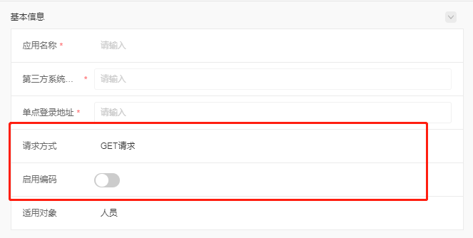
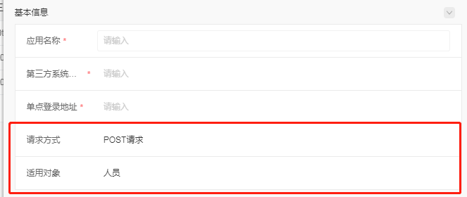

# 跨行联动

由于公共组件暂时未支持 form 中联动的处理，所以集成模块先自己定义一套前后端联动的数据格式。

## 1. 数据格式

跨行联动的数据格式主要定义在 `items` 属性中。items 的每一项（item）是 Map 类型，里面可以塞入任何前端需要的数据，所以在处理跨行联动时，需要在 item 中塞入 `showWhere` 字段。具体格式如下：

```json
{
  "items": {
    "A": {
      "itemType": "INPUT",
      "otherParams": {
        "showWhere": [
          {
            "id": "B",
            "value": [
              "b"
            ]
          }
        ]
      }
    }
  }
}
```

解释下 `showWhere` 内容的含义：
**当 id 为 B 的字段 值为 'b' 时，显示 A 字段；否则隐藏 A 字段**

## 2. 示例 demo

### 需求
e10 集成登录功能要实现：
1. 当请求方式（requestMethod）为 `get`，`显示`启用编码字段（urlEncode）；
2. 当请求方式（requestMethod）为 `post`，`隐藏`启用编码字段（urlEncode）；

### 后端接口返回的数据格式
```json
{
  "data": {},
  "group": [],
  "layout": [],
  "items": {
    "requestMethod": {
      "itemType": "SELECT",
      "data": [
        {
          "id": "post",
          "content": "POST请求"
        },
        {
          "id": "get",
          "content": "GET请求"
        }
      ]
    },
    "urlEncode": {
      "itemType": "SWITCH",
      "defaultValue": true,
      "otherParams": {
        "showWhere": [
          {
            "id": "requestMethod",
            "value": [
              "get"
            ]
          }
        ]
      }
    }
  }
}
```

### 页面效果

