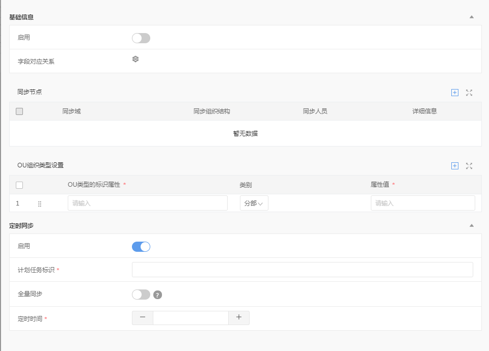

# 页面穿插渲染多个 form 和多个可编辑列表时接口返回的数据格式

## 使用场景
1. 页面渲染了多个可编辑列表，则接口返回的可编辑列表相关的数据格式定义为： `customParam, customParam1, customParam2, ...`
2. 页面渲染了多个 form 表单和 N（N > 0） 个可编辑列表，且可编辑列表穿插在 form 表单之间，则接口返回的数据格式为：`customParam、formSetting、formSetting1、formSetting2、...`

## 数据格式
```json
{
  "formSetting": {},
  "formSetting1": {},
  "formSetting2": {},
  "customParam": {},
  "customParam1": {},
  "customParam2": {}
}
```

## 示例
以 ldap 页面的正向同步为例，列举渲染页面时接口返回的数据格式。
### 页面展示


### 数据格式
```json
{
  "code": 200,
  "msg": "接口返回成功",
  "status": true,
  "data": {
    "button": [],
    "formSetting": {
      "groups": [{
        "id": "g1",
        "title": "基础信息",
        "visible": true,
        "custom": false
      }],
      "layout": [
        [
          {
            "id": "isUsed",
            "label": "启用",
            "labelSpan": 6,
            "order": 0,
            "groupId": "g1",
            "hide": false,
            "items": [
              "isUsed"
            ],
            "otherParams": {}
          }
        ],
        [
          {
            "id": "fieldMap",
            "label": "字段对应关系",
            "labelSpan": 6,
            "order": 0,
            "groupId": "g1",
            "hide": false,
            "items": [
              "fieldMap"
            ],
            "otherParams": {}
          }
        ]
      ],
      "items": {
        "fieldMap": {
          "itemType": "CUSTOM",
          "visible": true,
          "disable": false,
          "required": false,
          "readOnly": false,
          "multiple": false,
          "common": false,
          "otherParams": {}
        },
        "isUsed": {
          "itemType": "SWITCH",
          "visible": true,
          "disable": false,
          "required": false,
          "readOnly": false,
          "multiple": false,
          "common": false,
          "otherParams": {}
        }
      },
      "data": {
        "isUsed": "0"
      }
    },
    "customParam": {
      "data": [],
      "sortableType": "icon",
      "columns": [
        {
          "comKey": "baseDomain",
          "dataIndex": "baseDomain",
          "width": "30%",
          "title": "同步域"
        },
        {
          "comKey": "isSyncOrg",
          "dataIndex": "isSyncOrg",
          "width": "25%",
          "title": "同步组织结构"
        },
        {
          "comKey": "isSyncUser",
          "dataIndex": "isSyncUser",
          "width": "25%",
          "title": "同步人员"
        },
        {
          "comKey": "detail",
          "dataIndex": "detail",
          "width": "20%",
          "title": "详细信息"
        }
      ],
      "topTools": [
        {
          "icon": "Icon-Batch-modification",
          "type": "batchEdit",
          "title": "批量编辑"
        },
        {
          "icon": "Icon-Batch-delete",
          "type": "batchDelete",
          "title": "批量删除"
        },
        {
          "icon": "Icon-add-to03",
          "type": "add",
          "title": "新增"
        },
        {
          "icon": "Icon-Global-zoom-in",
          "type": "maximize",
          "title": "最大化"
        }
      ],
      "deleteConfirm": true,
      "comProps": {
        "baseDomain": {
          "itemType": "INPUT",
          "readOnly": true
        },
        "isSyncOrg": {
          "itemType": "INPUT",
          "readOnly": true
        },
        "isSyncUser": {
          "itemType": "INPUT",
          "readOnly": true
        },
        "detail": {
          "itemType": "CUSTOM",
          "readOnly": true
        }
      },
      "sortable": true,
      "title": "同步节点",
      "rowTools": [
        {
          "icon": "Icon-delete",
          "type": "delete",
          "title": "删除"
        },
        {
          "icon": "Icon-Insert-forward",
          "type": "insertUp",
          "title": "向前插入一行"
        },
        {
          "icon": "Icon-Insert-after-line",
          "type": "insertDown",
          "title": "向后插入一行"
        },
        {
          "icon": "Icon-copy",
          "type": "copy",
          "title": "复制"
        }
      ]
    },
    "customParam1": {
      "data": [],
      "sortableType": "icon",
      "columns": [
        {
          "comKey": "attributeName",
          "showRequired": true,
          "dataIndex": "attributeName",
          "width": "40%",
          "title": "OU类型的标识属性"
        },
        {
          "comKey": "attributeType",
          "dataIndex": "attributeType",
          "width": "30%",
          "title": "类别"
        },
        {
          "comKey": "attributeValue",
          "showRequired": true,
          "dataIndex": "attributeValue",
          "width": "30%",
          "title": "属性值"
        }
      ],
      "topTools": [
        {
          "icon": "Icon-Batch-modification",
          "type": "batchEdit",
          "title": "批量编辑"
        },
        {
          "icon": "Icon-Batch-delete",
          "type": "batchDelete",
          "title": "批量删除"
        },
        {
          "icon": "Icon-add-to03",
          "type": "add",
          "title": "新增"
        },
        {
          "icon": "Icon-Global-zoom-in",
          "type": "maximize",
          "title": "最大化"
        }
      ],
      "deleteConfirm": true,
      "comProps": {
        "attributeName": {
          "itemType": "INPUT",
          "placeholder": "请输入",
          "required": true
        },
        "attributeType": {
          "itemType": "SELECT",
          "placeholder": "请输入",
          "required": true,
          "data": [
            { "id": "0", "content": "分部" },
            { "id": "1", "content": "部门" }
          ],
          "defaultValue": "0"
        },
        "attributeValue": {
          "itemType": "INPUT",
          "placeholder": "请输入",
          "required": true
        }
      },
      "sortable": true,
      "title": "OU组织类型设置",
      "rowTools": [
        {
          "icon": "Icon-delete",
          "type": "delete",
          "title": "删除"
        },
        {
          "icon": "Icon-Insert-forward",
          "type": "insertUp",
          "title": "向前插入一行"
        },
        {
          "icon": "Icon-Insert-after-line",
          "type": "insertDown",
          "title": "向后插入一行"
        },
        {
          "icon": "Icon-copy",
          "type": "copy",
          "title": "复制"
        }
      ]
    },
    "formSetting1": {
      "groups": [{
        "id": "g1",
        "title": "定时同步",
        "visible": true,
        "custom": false
      }],
      "layout": [
        [
          {
            "id": "scheduleIsUsed",
            "label": "启用",
            "labelSpan": 6,
            "order": 0,
            "groupId": "g1",
            "hide": false,
            "items": [
              "scheduleIsUsed"
            ],
            "otherParams": {}
          }
        ],
        [
          {
            "id": "scheduleCode",
            "label": "计划任务标识",
            "labelSpan": 6,
            "order": 0,
            "groupId": "g1",
            "hide": false,
            "items": [
              "scheduleCode"
            ],
            "otherParams": {},
            "placeholder": "请输入"
          }
        ],
        [
          {
            "id": "isAllSync",
            "label": "全量同步",
            "labelSpan": 6,
            "order": 0,
            "groupId": "g1",
            "hide": false,
            "items": [
              "isAllSync"
            ],
            "otherParams": {},
            "helpTip": "提示信息"
          }
        ],
        [
          {
            "id": "cronexp",
            "label": "定时时间",
            "labelSpan": 6,
            "order": 0,
            "groupId": "g1",
            "hide": false,
            "items": [
              "cronexp"
            ],
            "otherParams": {}
          }
        ]
      ],
      "items": {
        "isAllSync": {
          "itemType": "SWITCH",
          "visible": true,
          "disable": false,
          "required": false,
          "readOnly": false,
          "multiple": false,
          "common": false,
          "otherParams": {
            "showWhere": [
              {"value": ["1"], "id": "scheduleIsUsed"}
            ]
          }
        },
        "cronexp": {
          "itemType": "INPUTNUMBER",
          "visible": true,
          "disable": false,
          "required": true,
          "readOnly": false,
          "multiple": false,
          "common": false,
          "otherParams": {
            "showWhere": [
              {"value": ["1"], "id": "scheduleIsUsed"}
            ]
          }
        },
        "scheduleIsUsed": {
          "itemType": "SWITCH",
          "visible": true,
          "disable": false,
          "required": false,
          "readOnly": false,
          "multiple": false,
          "common": false,
          "otherParams": {}
        },
        "scheduleCode": {
          "itemType": "INPUT",
          "visible": true,
          "disable": false,
          "required": true,
          "readOnly": false,
          "multiple": false,
          "common": false,
          "otherParams": {
            "showWhere": [
              {"value": ["1"], "id": "scheduleIsUsed"}
            ]
          }
        }
      },
      "data": {
        "scheduleIsUsed": "0"
      }
    }
  }
}
```