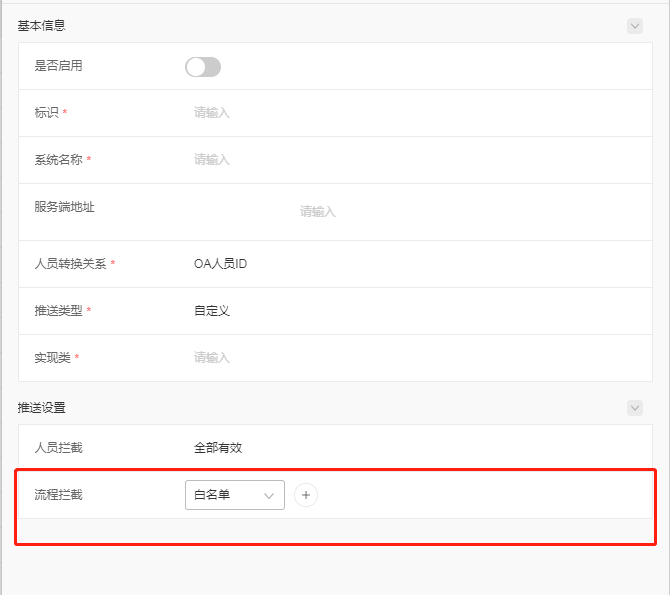
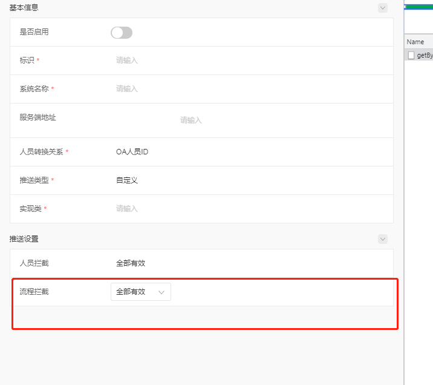

# 行内联动

由于公共组件暂时未支持 form 中联动的处理，所以集成模块先自己定义一套前后端联动的数据格式。

## 1. 数据格式

行内联动的数据格式主要定义在 `layout` 属性中。在处理行内联动时，需要在 layout 中塞入 `showWhere` 字段。具体格式如下：

```json
{
  "layout": [
    [{
      "id": "B",
      "items": [
        "hrmFilterRule",
        "hrmFilter"
      ],
      "otherParams": {
        "showWhere": [
          {
            "id": "A",
            "value": "0",
            "items": [
              "hrmFilterRule"
            ]
          }
        ]
      }
    }]
  ]
}
```

解释下 `showWhere` 内容的含义：
**当 id 为 A 的字段 值为 '0' 时，id 为 B 的行显示的组件是 "hrmFilterRule"；否则 id 为 B 的行内显示的组件是[ "hrmFilterRule", "hrmFilter"]**

## 2. 示例 demo

### 需求
e10 统一待办推送设置功能要实现：
1. 当流程拦截行内的下拉框选择了`全部有效`，则隐藏后面的浏览框；
2. 当流程拦截行内的下拉框选择了`白名单`或`黑名单`，则显示后面的浏览框，可通过浏览框选择值；

### 后端接口返回的数据格式
```json
{
  "data": {},
  "group": [],
  "layout": [
    [
      {
        "id": "workflowFilterRule",
        "label": "流程拦截",
        "labelSpan": 6,
        "order": 0,
        "groupId": "push",
        "hide": false,
        "items": [
          "workflowFilterRule",
          "workflowFilter"
        ],
        "otherParams": {
          "showWhere": [ // id 不传，默认取与 otherParams 同级的 id 值
            {
              "value": "0",  
              "items": [
                "workflowFilterRule"
              ]
            }
          ]
        }
      }
    ]
  ],
  "items": {
    "workflowFilter": {
      "itemType": "BROWSER",
      "visible": true,
      "disable": false,
      "required": false,
      "readOnly": false,
      "multiple": false,
      "common": false,
      "browserBean": {
        "hasAdvanceSearch": false,
        "hasLeftData": false,
        "disabledTabCache": false,
        "showCheckStrictly": true,
        "canSelectAllUser": false,
        "showAccount": false,
        "defaultCheckStrictly": true,
        "defaultAccount": false,
        "module": "workflow/pathdef",
        "type": "workflowPathBrowser",
        "multiple": true,
        "defaultOpen": false,
        "multType": false,
        "multCheckbox": false
      },
      "otherParams": {}
    },
    "workflowFilterRule": {
      "itemType": "SELECT",
      "visible": true,
      "disable": false,
      "options": [
        {
          "id": "0",
          "content": "全部有效",
          "disabled": false
        },
        {
          "id": "1",
          "content": "白名单",
          "disabled": false
        },
        {
          "id": "2",
          "content": "黑名单",
          "disabled": false
        }
      ],
      "required": false,
      "readOnly": false,
      "multiple": false,
      "common": false,
      "otherParams": {
        
      }
    }
  }
}
```

### 页面效果

